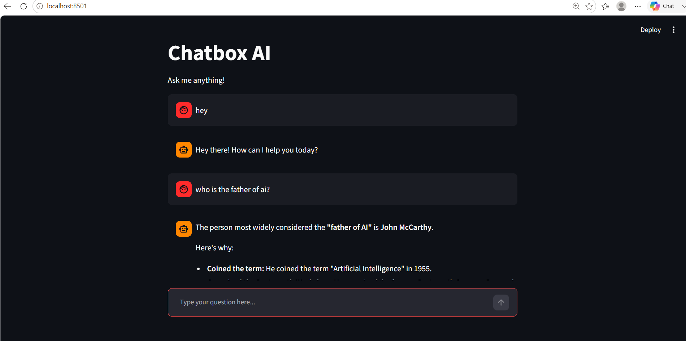

# 🤖 Chatbox AI

An AI-powered chatbot built using **Python**, **Streamlit**, and **Google Gemini AI**. This application provides an interactive chat interface where users can ask questions and receive intelligent responses generated by Google's Gemini model.

---

## 📖 Overview

Chatbox AI is a simple and user-friendly chatbot that demonstrates how to integrate Google's Gemini AI model into a Streamlit web application. It securely manages API keys using environment variables and provides a clean interface for real-time conversations.

---

## ✨ Features

- 💬 Interactive chat interface
- 🤖 Google Gemini AI integration
- ⚡ Fast and responsive Streamlit application
- 🔐 Secure API key management using `.env`
- 🎨 Clean and simple user interface

---

## 🛠️ Tech Stack

- Python
- Streamlit
- Google Generative AI (Gemini)
- python-dotenv

---

## 📂 Project Structure

```
chatbox-ai/
│── main.py
│── .env
│── .gitignore
│── README.md
│── requirements.txt
└── vir/
```

---

## 🚀 Installation

### 1. Clone the repository

```bash
git clone https://github.com/your-username/chatbox-ai.git
cd chatbox-ai
```

### 2. Create a virtual environment

**Windows**

```bash
python -m venv vir
vir\Scripts\activate
```

**macOS/Linux**

```bash
python3 -m venv vir
source vir/bin/activate
```

### 3. Install dependencies

```bash
pip install -r requirements.txt
```

### 4. Configure the API Key

Create a `.env` file in the project folder and add:

```env
GEMINI_API_KEY=YOUR_GEMINI_API_KEY
```

---

## ▶️ Run the Application

```bash
streamlit run main.py
```

The application will launch automatically in your default web browser.

---


## 📚 What I Learned

This project helped me learn:

- Streamlit web application development
- Google Gemini AI integration
- Environment variable management using `.env`
- Python package management
- Building an AI-powered chatbot

---

## 🔮 Future Improvements

- Save chat history
- Multiple conversation support
- Voice input and output
- File upload support
- Dark mode
- Export chat as PDF or TXT
- Better UI/UX

---

## 👩‍💻 Author

**Simranjeet Kaur**

Built as part of my AI and Python learning journey.

---
## 📸 Screenshot



---
## 📄 License

This project is intended for educational and portfolio purposes.